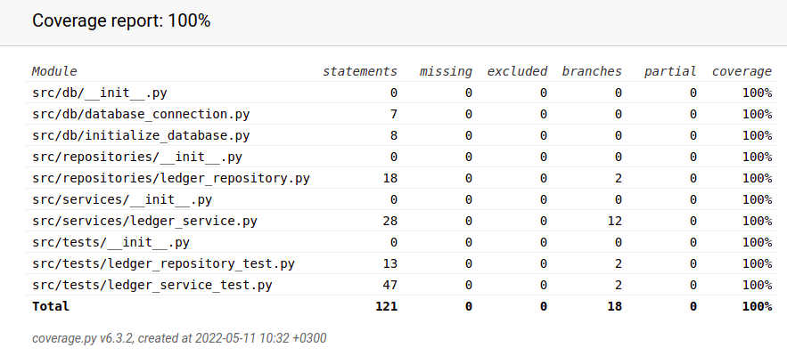

# Testausdokumentti

Ohjelmaa on testattu automatisoidusti unittestilla.

### Sovelluslogiikka
LedgerService-luokkaa, joka vastaa sovelluslogiikasta, testataan [TestLedgerService](https://github.com/meeries/ot-harjoitustyo/blob/master/budget-app/src/tests/ledger_service_test.py)-luokalla.

### Repositorio

LedgerRepository-luokkaa, eli repositorio-luokkaa, testataan [TestLedgerRepository](https://github.com/meeries/ot-harjoitustyo/blob/master/budget-app/src/tests/ledger_repository_test.py)-luokalla. Tästä testataan vain muutama metodi, sillä suurin osa repositorion metodeista testattiin LedgerService-luokan kanssa samaan aikaan.

### Testauskattavuus

Testauksen haaraumakattavuus on 100%:

### Asennus ja konfigurointi

Sovellus on haettu ja sitä on testattu manuaalisesti sekä Windows- ja Linux-ympäristössä.

### Toiminnallisuudet

Kaikki [vaatimusmäärittelyn](https://github.com/meeries/ot-harjoitustyo/blob/master/budget-app/dokumentaatio/vaatimusmaarittely.md) listaamat toiminnallisuudet toimivat, ja niitä on testattu myös virheellisillä syötteillä.

## Sovellukseen jääneet laatuongelmat

Sovellus ei anna järkeviä virheilmoituksia, jos
- Annettu syöte on tyhjä
- Syöte on vain yhden arvon pituinen
